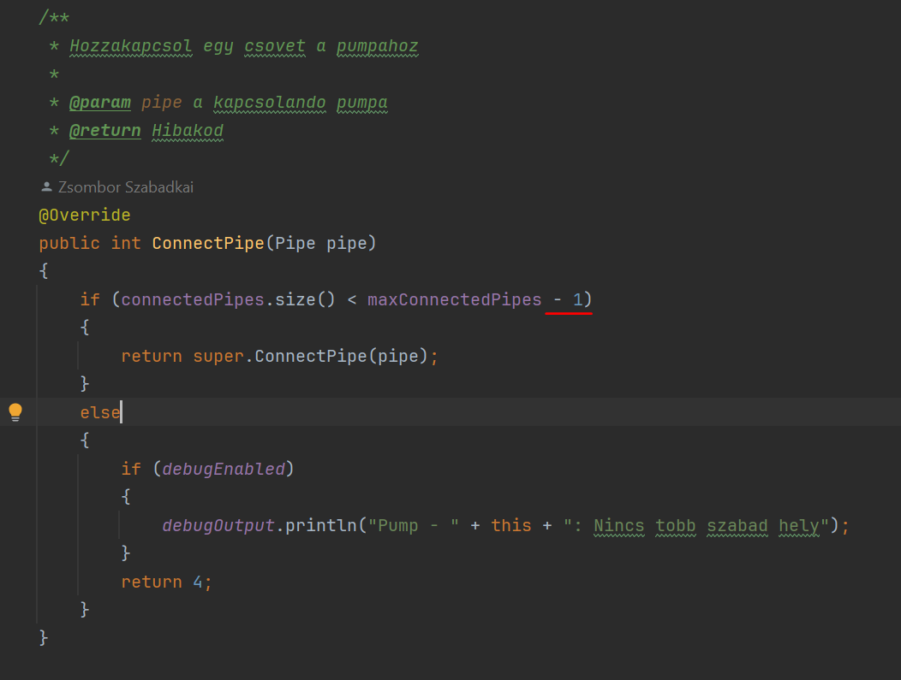

# junit-tests.md

## Done by Gergo Buzas

### What is JUnit?

JUnit is a unit testing framework for Java.
It is used to write and run repeatable tests for Java code. JUnit provides annotations
to identify test methods, assertions for testing expected results, and test runners to 
run the tests.

### Why JUnit?

JUnit is a popular choice for unit testing in Java because it is easy to use,
widely adopted, and integrates well with build tools like Maven and Gradle. 
It helps developers catch bugs early in the development process, improve code quality,
and ensure that changes to the code do not break existing functionality.

### What Unit tests were performed in the project?

As testing graphical parts of the project is not possible with JUnit (Selenium would be a 
great choice for UI testing), I have written
unit tests for the "objects" within the game. These objects are the following:
Drain, Pipe, Pipe, Source, Mechanic, and Game.

### Key takeaways

The project made it difficult to write unit tests for the separated Classes because of the
dependencies between them. 

**For example:** 
The Pipe class has a static game field, which
is a reference to the Game object, where the pipe objects are instantiated. 
This made it difficult to test the Pipe object in isolation.

The same can be said for the Drain, HOWEVER, to great surprise, not for the pumps.

### Errors found

After performing the tests, there was one part, where major errors were found.
It was the Pump class' connectPipe(Pipe pipe) function, where checking whether a new pipe
can be connected to the pump was not implemented correctly. This was fixed after the tests.

#### Wrong:

#### Correct:

### Code Coverage

The code coverage in certain cases cannot be improved, due to the fact, that lots of functions
have debug specific code, which is not meant to be tested. (e.g.: Printing to the console, when something is created)

Until now, I have used IntelliJ's built-in code coverage tool, which is not the best, but it is enough for now.
The idea is, to integrate codecov.io into the gradle build pipeline, to get a better overview of the code coverage.

### Conclusion

The project was a great opportunity to learn about JUnit and how to write unit tests for Java code.
It was a great experience to see how unit tests can help catch bugs early in the development process.
However, I feel like the project didn't do justice to the power of JUnit, as the objects were too tightly coupled.

